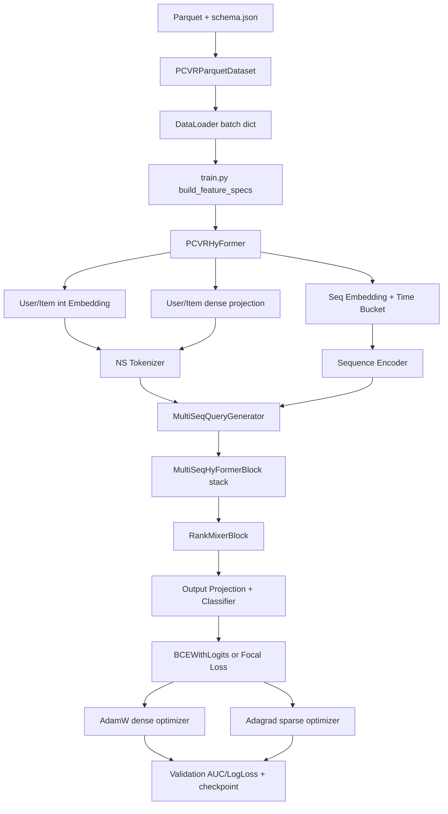

# TAAC2026 Baseline 极速理解文档

## 一、竞赛背景

- **2026 腾讯统一推荐挑战赛（TENCENT UNI-REC CHALLENGE）**
- **核心问题**：在一个模型架构中同时处理 **序列特征**（用户行为轨迹）和 **非序列特征**（用户/物品属性），统一建模预测 **pCVR**（post-click conversion rate，点击后转化率）
- **总奖金**：600 万元，学术赛道冠军 30 万美元
- **当前阶段**：Phase 3（2026.4.24 ~ 5.23），第一轮竞赛进行中

## 二、Baseline 代码结构

```
TAAC/
├── train/                          # 训练代码
│   ├── run.sh                      # 训练启动脚本（平台入口）
│   ├── train.py                    # 训练主入口（参数解析 + 主流程）
│   ├── model.py                    # PCVRHyFormer 模型定义（~1700行）
│   ├── dataset.py                  # Parquet 数据加载 + FeatureSchema
│   ├── trainer.py                  # 训练循环（BCE/Focal Loss + AUC 评估）
│   ├── utils.py                    # 工具函数（日志、早停、Focal Loss）
│   └── ns_groups.json              # NS 特征分组配置（可选）
├── eval/                           # 推理代码（上传平台评估用）
│   ├── infer.py                    # 推理脚本（必须包含 main() 函数）
│   ├── dataset.py                  # 与 train/dataset.py 相同
│   └── model.py                    # 与 train/model.py 相同
└── sample_data/                    # 样本数据（1000条）
    ├── demo_1000.parquet           # Parquet 数据文件
    └── README_data.md              # 数据说明文档
```

## 三、数据格式速览

| 类别 | 列数 | 类型 | 说明 |
|---|---|---|---|
| ID & Label | 5 | int64/int32 | `user_id`, `item_id`, `label_type`, `label_time`, `timestamp` |
| User Int Features | 46 | int64 / list<int64> | 用户离散特征（标量或数组） |
| User Dense Features | 10 | list<float> | 用户连续特征（数组） |
| Item Int Features | 14 | int64 / list<int64> | 物品离散特征 |
| Domain Sequence | 45 | list<int64> | 4 个行为域的序列特征 |

- **label**：`label_type == 2` 为正样本（转化），其余为负样本
- **格式**：Parquet，1000 行 x 120 列

## 四、模型架构：PCVRHyFormer

```
输入层
  ├── User Int Features ──→ Embedding Lookup ──┐
  ├── Item Int Features ──→ Embedding Lookup ──┤
  ├── User Dense Features ──→ Linear Project ──┼──→ NS Tokenizer（转为 token）
  ├── Item Dense Features ──→ Linear Project ──┤
  │
  ├── Domain A Sequence ──→ Embedding + Time Bucket ──┐
  ├── Domain B Sequence ──→ Embedding + Time Bucket ──┼──→ Seq Encoder（Transformer）
  ├── Domain C Sequence ──→ Embedding + Time Bucket ──┤     → Query Generator
  └── Domain D Sequence ──→ Embedding + Time Bucket ──┘

                         ↓
               HyFormer Block × N
  （序列 Query 与非序列 NS Token 做交叉注意力 + SwiGLU FFN）
                         ↓
               RankMixer（token 级别特征融合）
                         ↓
               Output Projection + Classifier
                         ↓
               pCVR 概率（0~1）
```

### 核心组件

| 组件 | 作用 |
|---|---|
| **NS Tokenizer** | 把非序列特征（user/item int+dense）编码为固定数量的 token |
| **Seq Encoder** | 对 4 个行为域序列分别做自注意力编码，支持 Transformer / SwiGLU / Longer 三种变体 |
| **HyFormer Block** | 交叉注意力层：序列 Query ←→ 非序列 NS Token，实现统一建模 |
| **RankMixer** | 对混合后的所有 token 做特征交互（可选 full/ffn_only/none） |
| **RoPE** | 可选的旋转位置编码，注入序列时序信息 |

## 五、训练流程速览

```python
# 1. 加载数据（Parquet → IterableDataset → DataLoader）
train_loader, valid_loader, dataset = get_pcvr_data(
    data_dir=..., schema_path=..., batch_size=256
)

# 2. 构建模型
model = PCVRHyFormer(
    user_int_feature_specs=...,    # [(vocab_size, offset, length), ...]
    item_int_feature_specs=...,    # 同上
    user_dense_dim=...,            # dense 特征总维度
    item_dense_dim=...,            # 同上
    seq_vocab_sizes=...,           # 各序列域 vocab
    d_model=64,                    # 隐藏维度
    num_hyformer_blocks=2,         # HyFormer 层数
    num_heads=4,                   # 注意力头数
    ...
)

# 3. 双优化器
sparse_optimizer = Adagrad(Embedding 参数, lr=0.05)
dense_optimizer  = AdamW(其余参数, lr=1e-4)

# 4. 训练循环
for epoch in range(num_epochs):
    for batch in train_loader:
        loss = BCEWithLogitsLoss(model(batch), label)
        loss.backward()
        sparse_optimizer.step()
        dense_optimizer.step()
    # 每轮验证 → 早停 / 保存 ckpt
    auc = roc_auc_score(y_true, y_pred)
```

### 关键超参数（run.sh 默认值）

| 参数 | 默认值 | 说明 |
|---|---|---|
| `--ns_tokenizer_type` | `rankmixer` | NS tokenizer 类型：rankmixer / group |
| `--user_ns_tokens` | 5 | user 非序列特征压缩为 5 个 token |
| `--item_ns_tokens` | 2 | item 非序列特征压缩为 2 个 token |
| `--num_queries` | 2 | 每个序列域生成 2 个 query token |
| `--d_model` | 64 | 模型隐藏维度 |
| `--emb_dim` | 64 | Embedding 维度 |
| `--num_hyformer_blocks` | 2 | HyFormer 层数 |
| `--num_heads` | 4 | 注意力头数 |
| `--seq_encoder_type` | `transformer` | 序列编码器类型 |
| `--batch_size` | run.sh 当前为 128 | 批量大小；云平台 19GB 卡上默认 256 可能 OOM |
| `--lr` | 1e-4 | 稠密参数学习率 |
| `--sparse_lr` | 0.05 | 稀疏 Embedding 学习率 |
| `--loss_type` | `bce` | BCE / Focal Loss |
| `--num_epochs` | run.sh 当前为 20 | 最大训练轮数（早停会提前终止） |
| `--patience` | run.sh 当前为 15 | 早停容忍轮数（验证 AUC 不提升） |
| `--reinit_sparse_after_epoch` | run.sh 当前为 0 | 从第 N 轮开始每轮结束后重置符合条件的 Embedding |
| `--reinit_cardinality_threshold` | run.sh 当前为 0 | 仅 vocab_size > 此值的 Embedding 被重置；0 表示全量重置正基数 Embedding |
| `--emb_skip_threshold` | 1000000 | 超过此 vocab_size 的特征不建 Embedding（省显存） |
| `--amp` | run.sh 当前开启 | CUDA 混合精度训练/评估，当前使用 bf16 降显存 |
| `--torch_compile` | 默认关闭 | 可选 `torch.compile(model.forward)` 加速 |

### ⚠️ 跨文件参数一致性（极易踩坑）

模型配置涉及 **三个文件** 联动，任一不一致都会导致 eval 时 **shape mismatch 或 d_model % T != 0 报错**：

```
train/run.sh         ← 训练入口，显式传参覆盖 train.py 默认值
train/train.py       ← argparse 默认值（env 变量 > 显式参数 > 默认值）
eval/infer.py        ← _FALLBACK_MODEL_CFG（当 ckpt 目录缺 train_config.json 时兜底）
```

**当前已同步的活跃配置（三者必须一致）：**

| 参数 | run.sh 显式值 | train.py 默认值 | infer.py fallback |
|---|---|---|---|
| `ns_tokenizer_type` | `rankmixer` | `rankmixer` | `rankmixer` |
| `user_ns_tokens` | `5` | `5` | `5` |
| `item_ns_tokens` | `2` | `2` | `2` |
| `num_queries` | `2` | `2` | `2` |
| `emb_skip_threshold` | `1000000` | `1000000` | `1000000` |
| `d_model` | — | `64` | `64` |
| `num_hyformer_blocks` | — | `2` | `2` |
| `num_heads` | — | `4` | `4` |

**一致性检查公式**（`rank_mixer_mode=full` 时生效）：
```
d_model % T == 0, 其中 T = num_queries * num_sequences + num_ns
num_ns = user_ns_tokens + (1 if user_dense>0 else 0)
       + item_ns_tokens + (1 if item_dense>0 else 0)
```
如果 `user_ns_tokens` 或 `num_queries` 在三个文件中不一致，eval 重建模型时 T 值不同，就会触发 `d_model % T != 0` 错误。

**修改任何训练参数后，必须同步更新 `eval/infer.py` 的 `_FALLBACK_MODEL_CFG`。**

## 六、推理流程（eval/infer.py）

```python
def main():
    # 1. 从环境变量读取路径
    model_dir = os.environ['MODEL_OUTPUT_PATH']   # ckpt 目录
    data_dir  = os.environ['EVAL_DATA_PATH']      # 测试数据
    result_dir = os.environ['EVAL_RESULT_PATH']   # 输出目录

    # 2. 加载模型（从 train_config.json + schema.json 重建）
    model = build_model(dataset, model_cfg)
    load_model_state_strict(model, ckpt_path)

    # 3. 推理
    for batch in test_loader:
        logits = model(batch)
        probs = sigmoid(logits)

    # 4. 输出 predictions.json
    {
        "predictions": {
            "用户ID字符串": 0.85,   # 转化概率
            ...
        }
    }
```

## 七、平台环境变量（训练）

| 环境变量 | 用途 |
|---|---|
| `TRAIN_DATA_PATH` | 训练数据目录（*.parquet + schema.json） |
| `TRAIN_CKPT_PATH` | 模型检查点保存目录 |
| `TRAIN_LOG_PATH` | 日志目录 |
| `TRAIN_TF_EVENTS_PATH` | 已不再作为运行依赖；平台主要查看 `train.log` |

## 八、平台环境变量（评估）

| 环境变量 | 用途 |
|---|---|
| `MODEL_OUTPUT_PATH` | 模型 ckpt 目录 |
| `EVAL_DATA_PATH` | 测试数据目录 |
| `EVAL_RESULT_PATH` | predictions.json 输出目录 |
| `EVAL_INFER_PATH` | 推理脚本目录 |

## 九、本地跑通步骤（缺失 schema.json 情况）

> 当前 demo 数据包缺少 `schema.json`，这是训练和推理的必需文件。

### 方案 A：补齐 schema.json（推荐）

需要从 parquet 列元数据分析生成：
- `user_int`: `[[fid, vocab_size, dim], ...]`
- `item_int`: `[[fid, vocab_size, dim], ...]`
- `user_dense`: `[[fid, dim], ...]`
- `seq`: `{domain: {prefix, ts_fid, features: [[fid, vocab_size], ...]}}`

### 方案 B：修改代码绕过 schema.json

在 `dataset.py` 中直接从 parquet 列名推断 schema（需改 `_load_schema` 和 `get_pcvr_data`）。

### 依赖安装

```bash
pip install torch pandas pyarrow numpy tqdm scikit-learn
```

### 本地训练命令

```bash
cd train
python train.py \
    --data_dir ../sample_data \
    --schema_path ../sample_data/schema.json \
    --ckpt_dir ./ckpt \
    --log_dir ./logs \
    --batch_size 64 \
    --num_epochs 10 \
    --device cpu
```

### 稀疏 Embedding 重置策略（MEDA 机制）

Baseline 采用快手 MEDA 论文的多 epoch 训练思想：

- **Embedding 层**（稀疏参数，Adagrad）：每个 epoch 结束时，高基数特征（vocab > threshold）的 Embedding 被重新随机初始化，防止同一 ID 被死记硬背。低基数特征（如性别、城市）保留 Adagrad 累积历史，正常收敛。
- **MLP/Transformer 层**（稠密参数，AdamW）：持续更新，不受 reset 影响。MLP 学习的是 embedding 间的相对关系，不依赖绝对位置。

> **注意**：`reinit_cardinality_threshold=0` 表示**所有正基数 Embedding**都会在触发轮次后重置。这不是“禁用 reinit”，而是全量 MEDA 消融；它可能增强正则，也可能因低基数稳定特征被重置而伤害收敛。禁用 reinit 应使用 `--reinit_sparse_after_epoch 999 --reinit_cardinality_threshold 999999999` 这类组合。

## 十、快速迭代建议

1. **数据侧**：先生成 schema.json 跑通 baseline，再研究数据分布和特征工程
2. **模型侧**：重点调 `d_model`, `num_hyformer_blocks`, `num_queries`, `seq_max_lens`
3. **训练侧**：BCE vs Focal Loss、学习率、早停 patience
4. **序列侧**：尝试 `seq_encoder_type=longer`（Top-K 压缩）处理超长序列
5. **评估侧**：确保 predictions.json 的键与测试集 user_id 完全一致

---

**文档生成时间**：2026-04-25 | **模型版本**：PCVRHyFormer Baseline

---

## 十一、架构级 Code Review 与技术迁移指南

本节按“推荐系统架构师读源码”的方式梳理当前 baseline，目标不是只知道每个文件做什么，而是理解它为什么这样设计、如何迁移、以及实验时哪些旋钮最容易混淆。

### 11.1 项目整体架构与数据流

**核心价值与定位**

PCVRHyFormer 解决的是典型的推荐转化预估问题：同时利用用户/物品非序列画像特征，以及多个行为域的长序列特征，预测点击后转化概率。它的设计重点不是单纯 MLP 交叉，而是把非序列特征转成 NS tokens，把每个序列域转成 sequence tokens，再用 query token 和 HyFormer block 做跨域交互。

该 baseline 当前最像一个“多行为域序列增强的 Deep CTR/CVR 模型”：

- 长序列建模：`seq_a/seq_b/seq_c/seq_d` 分域建模，支持 Transformer、SwiGLU、LongerEncoder。
- 多源特征融合：user/item int、dense、sequence、time bucket 同时进入模型。
- 高基数 ID 过拟合处理：`emb_skip_threshold` 控制是否建表，`reinit_*` 控制多 epoch 重置策略。
- 平台可复现：checkpoint 旁写出 `schema.json`、`train_config.json`、可选 `ns_groups.json`，eval 优先从 checkpoint sidecar 重建模型。

**高级数据流图**



**主入口与训练循环**

- 训练入口：`train/run.sh` 调用 `train/train.py`，平台参数可通过 `"$@"` 追加覆盖。
- 参数解析：`train/train.py::parse_args()`，其中环境变量 `TRAIN_DATA_PATH/TRAIN_CKPT_PATH/TRAIN_LOG_PATH` 会覆盖 CLI 路径参数。
- 数据构建：`train/dataset.py::get_pcvr_data()` 创建 train/valid 两个 `DataLoader`。
- 模型构建：`train/train.py::main()` 组装 `model_args`，实例化 `PCVRHyFormer`。
- 训练循环：`train/trainer.py::PCVRHyFormerRankingTrainer.train()`。
- 单步训练：`trainer._train_step()` 负责 forward、loss、backward、clip grad、dense/sparse optimizer step。
- 验证保存：`trainer.evaluate()` 计算 AUC/LogLoss，`_handle_validation_result()` 只在 new best 时保存 `model.pt` 和 sidecar 文件。

训练 loop 的关键设计是“双优化器”：

```python
sparse_optimizer = torch.optim.Adagrad(embedding_params, lr=sparse_lr)
dense_optimizer = torch.optim.AdamW(non_embedding_params, lr=lr)
```

为什么这样做：CTR/CVR 模型里稀疏 ID embedding 是参数主体，访问稀疏、频次长尾，Adagrad 对高频/低频 ID 的自适应累计更常见；Transformer/MLP 等 dense 参数则更适合 AdamW。

### 11.2 特征工程与 Embedding

**代码位置**

- `train/dataset.py::FeatureSchema`
- `train/dataset.py::PCVRParquetDataset._load_schema`
- `train/dataset.py::PCVRParquetDataset._make_batch`
- `train/train.py::build_feature_specs`
- `train/model.py::GroupNSTokenizer`
- `train/model.py::RankMixerNSTokenizer`
- `train/model.py::PCVRHyFormer._embed_seq_domain`

**Dense / Sparse / Sequence 的处理方式**

- Sparse int：schema 中每个 feature 记录 `(fid, offset, length)`，多值特征会被 padding 到固定长度。模型侧每个 fid 建一个 `nn.Embedding(vocab_size + 1, emb_dim, padding_idx=0)`，再 concat/project。
- Dense：user dense 被拼成一条连续 float 向量，经过 `user_dense_proj` 变成一个 token。当前 item dense 在 dataset 返回中是空张量，模型保留了兼容入口。
- Sequence：每个行为域是 `[B, C, L]`，C 是该域 side-info 特征数，L 是截断后的最大长度。每个序列特征各自 embedding，concat 后经过线性层投到 `d_model`。
- Time bucket：dataset 根据当前样本 `timestamp` 与行为时间戳差值做 bucket，模型侧用 `time_embedding` 加到 sequence token 上。

**特殊工程技巧**

- 预分配 numpy buffer，减少每 batch 的临时数组创建。
- 使用 row group 划分 train/valid，valid 默认取尾部 row groups。
- `clip_vocab=True` 时越界 ID 会被归零，避免 embedding index error。
- `torch.multiprocessing.set_sharing_strategy('file_system')` 避免多 worker 下 `/dev/shm` 不够。
- `emb_skip_threshold` 对超高基数特征不建 embedding，forward 时用零向量占位，省显存。
- `seq_id_threshold` 给序列 ID 特征额外 dropout，低基数 side-info 不额外 dropout。

**迁移建议**

如果接入自己的业务特征，最小改动路径是：

1. 生成兼容 `schema.json`，保持 user_int/item_int/user_dense/seq 的结构。
2. 保证训练和评估的 `train/dataset.py`、`eval/dataset.py` 逻辑一致。
3. 新增 sequence domain 时同步检查 `num_sequences`，因为 `T = num_queries * num_sequences + num_ns` 会影响 RankMixer 的 `d_model % T == 0` 约束。
4. 改 time bucket 边界时必须同步 train/eval 两份 `BUCKET_BOUNDARIES`，并确保 `NUM_TIME_BUCKETS` 与 checkpoint 中的模型结构一致。

### 11.3 核心算法模块：PCVRHyFormer 的 Secret Sauce

**模块定位**

- `MultiSeqQueryGenerator`：`train/model.py`
- `MultiSeqHyFormerBlock`：`train/model.py`
- `RankMixerBlock`：`train/model.py`
- `RankMixerNSTokenizer`：`train/model.py`

**算法思想**

PCVRHyFormer 的核心思路是：不要把所有特征粗暴 flatten 后送进 MLP，而是让非序列画像先形成 NS tokens，序列行为形成 sequence tokens，再为每个序列域生成 query tokens。query tokens 作为“用户当前意图探针”，反复从序列和非序列上下文里吸收信息，最后输出到分类器。

关键 shape：

- NS tokens: `[B, num_ns, D]`
- 每个序列域 tokens: `[B, L, D]`
- Query tokens: 每个域 `[B, num_queries, D]`
- HyFormer 输出拼接: `[B, num_sequences * num_queries * D]`

**为什么用 token 化而不是直接拼接 MLP**

- 直接拼接会把长序列压成一个静态向量，容易损失行为顺序和域间差异。
- token 化后可以用 attention 显式建模“哪个行为域、哪个时间段、哪个非序列画像”对当前预测更重要。
- RankMixer 对 token 维度做交互，比单纯 feature-wise MLP 更贴近“多个意图 token 排名融合”的问题。

**RankMixer 约束**

`rank_mixer_mode=full` 时，`RankMixerBlock` 会沿 token 维做混合，因此要求：

```text
d_model % T == 0
T = num_queries * num_sequences + num_ns
```

当前 RankMixer 配置：

```text
num_sequences = 4
num_queries = 2
user_ns_tokens = 5
item_ns_tokens = 2
user_dense token = 1
item_dense token = 0 或 1（取决于 schema）
当前日志实际 T=16，d_model=64，64 % 16 == 0
```

迁移或调参时，改 `num_queries/user_ns_tokens/item_ns_tokens/d_model` 必须先算这个约束。否则训练端或 eval 重建时会直接失败。

**即插即用迁移方式**

比较适合迁移的独立模块：

- `RankMixerBlock`：输入 `[B, T, D]`，输出 `[B, T, D]`。适合接在任何 token-based 推荐模型后面。
- `MultiSeqQueryGenerator`：需要 NS tokens 和多个 sequence tokens，适合多行为域模型。
- `RankMixerNSTokenizer`：适合大量非序列 sparse 特征，希望压缩成固定 token 数的场景。

迁移到 Wide&Deep / DeepFM 时，最小可行方式是先迁移 `RankMixerNSTokenizer + RankMixerBlock`：

1. 把原 sparse embedding concat 后切成固定数量 token。
2. 用 RankMixer 做 token mixing。
3. flatten 后接原来的 DNN tower。

这样不需要一开始就迁移完整 HyFormer block，风险更低。

**迁移坑**

- token 数变化会影响 `d_model % T`。
- tokenizer 依赖 `feature_specs=(vocab_size, offset, length)`，不能直接吃任意 dict 特征。
- sequence 模块要求 batch 中包含 `_seq_domains`、`{domain}`、`{domain}_len`、可选 `{domain}_time_bucket`。
- eval 端必须同步 `eval/model.py`，否则 checkpoint 结构加载失败。

### 11.4 训练策略与 Loss

**样本构建与采样**

当前 baseline 没有显式负采样器。样本来自 parquet 原始数据：

- `label_type == 2` 映射为正样本。
- 其他 label type 映射为负样本。
- train/valid 按 row group 切分，valid 取尾部比例。

这意味着模型优化目标强依赖平台提供的数据分布。如果业务里曝光未点击、点击未转化、转化后多目标的定义不同，需要优先改 dataset 的 label 构建，而不是先改模型。

**Loss 设计**

- 默认：`BCEWithLogitsLoss`。
- 可选：`sigmoid_focal_loss`，通过 `--loss_type focal --focal_alpha ... --focal_gamma ...` 开启。
- 当前不是多任务模型，`action_num=1` 是单 logit 二分类。

如果业务要同时优化点击、转化、时长，可迁移为多任务：

1. `action_num` 改为多输出，或增加多个 prediction head。
2. dataset 返回多个 label。
3. trainer 中按任务计算 loss 并加权。
4. eval/infer 同步输出目标字段，避免线上线下目标不一致。

**Sparse reinit 语义澄清**

这两个参数经常被误解：

```bash
--reinit_sparse_after_epoch N
--reinit_cardinality_threshold K
```

真实语义是：当 `epoch >= N` 时，每个 epoch 结束后，重置所有 `vocab_size > K` 的 embedding，并重建 Adagrad optimizer。

- `N=0, K=0`：全量重置所有正基数 embedding。它是激进 MEDA 消融，不是稳定续训。
- `N=2, K=100000`：只重置极高基数 embedding。它更像“破坏性正则化”。
- `N=999, K=999999999`：基本禁用 reinit。它允许 embedding 跨 epoch 累积学习，但在本项目已有实验中可能导致更强 one-epoch 过拟合。

因此，`999/999999999` 不应被理解为“解决 one epoch 效应”。它只适合两个场景：

- 跑 `num_epochs=1` 的单轮官方 eval，不需要 reinit。
- 做“禁用 reinit”消融，确认过拟合到底有多严重。

对于长跑，当前更值得验证的是 `N=0,K=0` 或温和正则组合，而不是把禁用 reinit 当主方案。

### 11.5 当前两卡实验建议

已知约束：

- 1 epoch 约 1 小时。
- 晚上提交实验。
- 有两张卡。
- 经验上仅调参可能达到较好分数。
- 验证集与测试集关系不强，valid AUC 更适合诊断训练是否崩，而不是最终排名代理。

推荐分工：

**卡 1：机制验证长跑**

跑当前 `train/run.sh` 的全量 reinit 消融：

```bash
--num_epochs 20
--patience 15
--batch_size 128
--seq_max_lens seq_a:128,seq_b:128,seq_c:256,seq_d:256
--sparse_lr 0.05
--dropout_rate 0.01
--reinit_sparse_after_epoch 0
--reinit_cardinality_threshold 0
--amp
--amp_dtype bfloat16
```

观察重点：

- 平台日志是否打印 `reinit_cardinality_threshold=0`。
- reinit 日志是否为 `vocab>0`，而不是 `vocab>100000`。
- epoch2/3 是否出现良性回升，任意后续 epoch 是否超过 epoch1。
- LogLoss、prob_std、logit_std 是否比禁用 reinit 更稳定。

如果第一步 forward 就 OOM，优先级如下：

1. 确认日志里 `AMP config: enabled=True, dtype=bfloat16`。
2. 将 `batch_size` 从 128 降到 64。
3. 再把 `seq_max_lens` 降到 `seq_a:64,seq_b:64,seq_c:128,seq_d:128`。
4. 最后再考虑降低 `d_model` 或 `num_hyformer_blocks`，因为这会改变模型结构和可比性。

**卡 2：SwiGLU 序列编码器结构消融**

2026-04-29 已将第二张卡用于验证 `seq_encoder_type=swiglu`。该实验保留 full reinit、短序列和 bf16 AMP，只把序列编码器从 Transformer 换成 SwiGLU：

```bash
--num_epochs 20
--patience 10
--batch_size 128
--seq_max_lens seq_a:128,seq_b:128,seq_c:256,seq_d:256
--seq_encoder_type swiglu
--sparse_lr 0.05
--dropout_rate 0.01
--reinit_sparse_after_epoch 0
--reinit_cardinality_threshold 0
--amp
--amp_dtype bfloat16
```

该实验最终官方 eval AUC 为 `0.806956`，高于 Transformer full reinit 的 `0.80332`，但低于后续 `emb_skip_threshold=5000000` 的 `0.809921`。结论是：SwiGLU 是当前更稳的序列编码器基线，但提分关键已经从“换轻量编码器”转向“恢复并利用更多序列 ID/长序列信息”。

`--torch_compile` 暂不建议用于冲分实验。已有经验是 compile 可能掉 AUC，且首轮有编译开销；`--amp --amp_dtype bfloat16` 仍是当前保留的速度/显存开关。

### 11.6 当前实验进展（2026-04-30）

| 实验 | 关键配置 | valid 结果 | 官方 eval | 结论 |
|---|---|---:|---:|---|
| Full reinit Transformer OOM-safe | `transformer`, `batch=128`, `seq=128/128/256/256`, `bf16`, `reinit_after=0`, `threshold=0` | `0.860406@epoch7` | 0.80332 | 较旧 baseline eval 0.797713 有提升，但低于 SwiGLU |
| Full reinit SwiGLU OOM-safe | `swiglu`, 其他同上，`patience=10` | `0.861175@epoch6` | 0.806956 | 轻量序列编码器更稳、更省显存 |
| RankMixer + threshold 5M | `swiglu`, `emb_skip_threshold=5000000`, short seq | `0.861063@epoch6` | 0.809921 | 当前最佳，说明被 1M 跳过的高基数字段含有官方 test 有效信号 |
| Group NS | `group`, `num_queries=1`, `threshold=1M` | `0.861189@epoch7` | 0.805905 | valid 高但 eval 低，且 query 容量下降，不作为主线 |

Transformer full reinit 关键 valid 曲线：

```text
epoch1 valid AUC=0.855688, LogLoss=0.228127
epoch2 valid AUC=0.857923, LogLoss=0.230407
epoch3 valid AUC=0.858478, LogLoss=0.226766
epoch4 valid AUC=0.860081, LogLoss=0.227152
epoch5 valid AUC=0.860202, LogLoss=0.224951
epoch7 valid AUC=0.860406, LogLoss=0.225311
official eval AUC=0.80332
```

SwiGLU 实验关键日志：

```text
epoch1 valid AUC=0.856409, LogLoss=0.228545
epoch2 valid AUC=0.858486, LogLoss=0.228177
epoch3 valid AUC=0.859721, LogLoss=0.225764
epoch4 valid AUC=0.860341, LogLoss=0.225996
epoch5 valid AUC=0.859695, LogLoss=0.225844
epoch6 valid AUC=0.861175, LogLoss=0.225692
epoch7 valid AUC=0.860802, LogLoss=0.227167
epoch8 valid AUC=0.859335, LogLoss=0.226809
```

解读：

- Transformer full reinit 的 best valid 出现在 epoch7，SwiGLU full reinit 当前 best 出现在 epoch6；当前阶段不应再按“只训 1 epoch”作为默认策略。
- `swiglu + full reinit` 把最佳 valid 从 one-epoch 的 `0.8571` 推到 `0.861175`。
- reinit 日志显示 `Re-initialized 97 high-cardinality Embeddings (vocab>0), kept 1`，说明 full reinit 参数已生效。
- `prob_mean` 在 `0.0836~0.1012` 波动，仍需关注校准；官方 eval 比 valid 更关键。
- `emb_skip_threshold=5000000` 在官方 eval 上继续提升到 `0.809921`，因此当前主线是阈值、长序列和 LongerEncoder，而不是回头复刻 `reinit_after=2`。

### 11.7 项目亮点、局限与迁移路线图

**亮点**

- token-based 架构清晰，适合融合多行为域序列和非序列画像。
- train/eval 通过 sidecar 文件保持较强可复现性。
- 稀疏/稠密参数分优化器，符合推荐模型工程实践。
- 日志中已有 AUC、LogLoss、prob/logit 分布、grad_norm，可诊断过拟合和校准漂移。
- AMP 和 `torch.compile` 已做成 opt-in，不改变默认行为。

**局限**

- valid split 与官方 test 可能分布不一致，valid AUC 不能单独作为选模依据。
- 当前 label 是单任务二分类，无法直接表达点击、转化、时长等多目标。
- 时间特征只有 time-delta bucket embedding，尚未做更细的 session/recency/cross-domain 时间工程。
- `train/model.py` 与 `eval/model.py` 是复制关系，任何模型改动都必须双端同步。
- 全量 reinit 对低基数稳定特征也会重置，可能过度破坏收敛。

**迁移路线图**

第一步：最小可行验证

- 当前 full reinit 阶段不再默认只训 1 epoch；优先做 6-8 epoch 短训并提交 best checkpoint 官方 eval。
- 优先搜索 `seq_encoder_type/sparse_lr/dropout_rate/seq_max_lens/loss_type`。
- 每次只改一个主要变量，记录官方 eval、epoch1 valid、LogLoss、prob_mean。

第二步：核心模块迁移

- 从 `RankMixerBlock` 或 `RankMixerNSTokenizer` 开始迁移到简单 DNN tower。
- 保留现有 sparse embedding 表和 DNN，只在 embedding concat 后插入 token mixing。
- 对比同等参数量下的官方 eval，确认收益不是来自模型容量增加。

第三步：深度集成

- 再引入 `MultiSeqQueryGenerator + MultiSeqHyFormerBlock`。
- 将不同业务行为域拆成独立 sequence domain。
- 加入多任务 head，把 CVR、CTR、时长或价值目标拆开优化。

**三类高风险坑**

1. 训练/评估 schema 或模型参数不一致：最常见表现是 shape mismatch、embedding index error、`d_model % T` 报错。
2. reinit 语义误用：`threshold=0` 是全量重置，`999/999999999` 是禁用，不要混淆。
3. 线上线下分布不一致：valid AUC 下降不一定代表官方 eval 下降，反之亦然；必须建立官方 eval 反馈表。

### 11.8 结构分析下一步（2026-04-29）

当前最强官方 eval 为 `swiglu + full reinit` 的 `0.806956`，说明方向有效，但不应只局限于 `sparse_lr/dropout`。

一个关键发现：当前实验传了 `--ns_groups_json ""`，所以没有使用 `train/ns_groups.json` 的语义分组；`rankmixer` 实际上把 46 个 user int fid 按 schema 顺序拼成长向量后均分成 5 个 token。由于 `46*64/5` 不是整数个 feature embedding，user token 边界会切进某些 fid embedding 中间。item 侧 `14*64/2` 则刚好每 token 7 个 fid。

下一轮高信息增益实验：

```bash
--seq_encoder_type swiglu
--ns_tokenizer_type group
--ns_groups_json "${SCRIPT_DIR}/ns_groups.json"
--num_queries 1
--d_model 64
--num_heads 4
--batch_size 128
--seq_max_lens "seq_a:128,seq_b:128,seq_c:256,seq_d:256"
--reinit_sparse_after_epoch 0
--reinit_cardinality_threshold 0
--sparse_lr 0.05
--dropout_rate 0.01
--amp
--amp_dtype bfloat16
```

该实验将 `T = 1*4 + 12 = 16`，仍满足 `d_model=64` 的 RankMixer full 约束。它直接检验“语义 NS token”是否优于当前 rankmixer 均分 chunk。

已新增 EDA 脚本：

```bash
python research/code/inspect_pcvr_structure.py --parquet sample_data/demo_1000.parquet
```

如果有平台 `schema.json`，可加 `--schema /path/to/schema.json --ns-groups train/ns_groups.json`，脚本会输出 skipped fids 和 RankMixer token chunk 细节。

### 11.9 Notebook 走读带来的结构结论（2026-04-30）

同事提供的 `dataset_full_walkthrough.ipynb` / `model_full_walkthrough.ipynb` 对当前调参优先级有三点影响：

1. 数据侧确认 train/valid 是按 Row Group 切分，训练集只做 `buffer_batches` 窗口内 shuffle，不是全量随机；valid AUC 和官方 test 的相关性弱，不能只按 valid 排名选模型。
2. 时间特征已经进入模型：每个序列域会生成 `{domain}_time_bucket`，模型侧用 `nn.Embedding(NUM_TIME_BUCKETS, d_model, padding_idx=0)` 加到序列 token 上。时间特征工程可以做，但应在阈值/序列容量稳定后再改 bucket 边界。
3. 模型侧最值得迁移的不是单纯加深层数，而是 `LongerEncoder`：当 `L > seq_top_k` 时，用最近 top-k token 作为 Q，对完整序列做 cross-attention 压缩；后续 block 再在 top-k 上 self-attention。这正好对应 sample data 中 seq_a/seq_b/seq_c/seq_d 普遍远长于当前截断上限的问题。

对 `group` 实验的解释也要修正：它不是纯 NS 分组实验，因为为了满足 `d_model=64` 的 `d_model % T == 0` 约束，`num_queries` 从 2 降到了 1，序列 query 容量也被削弱。若后续重试 group，应使用 `d_model=80,num_queries=2,num_heads=4`，此时 `T=2*4+12=20` 且 `80 % 20 == 0`。

### 11.10 当前实验结论与下一轮两卡（2026-04-30）

已知官方 eval：

| 实验 | 关键配置 | 官方 eval AUC | 结论 |
|---|---|---:|---|
| Full reinit Transformer | `transformer, threshold=1M, short seq` | 0.80332 | full reinit 修复 one-epoch，但 transformer 不是当前最优 |
| Full reinit SwiGLU | `swiglu, threshold=1M, short seq` | 0.806956 | SwiGLU 更稳、更省显存 |
| RankMixer + threshold 5M | `swiglu, rankmixer, threshold=5M` | 0.809921 | 当前最佳；恢复部分高基数序列 ID 有收益 |
| Group NS | `swiglu, group, num_queries=1, threshold=1M` | 0.805905 | valid 高但官方低，且 query 容量下降，不作为主线 |

`emb_skip_threshold=0` 不可再试：它会把 sparse params 放大到约 `1.03e10`，Adagrad 初始化同尺寸 `sum` state 时 OOM。如果 `7M` 或更高阈值在平台上已经 optimizer OOM，则 `5M` 暂时就是可行上界，下一轮不要继续硬追阈值。

**卡 1：5M 阈值 + 恢复长序列**

目的：验证当前最佳 `5M` 高基数字段恢复收益，是否还能和更长行为序列叠加。SwiGLU 是 O(L) 编码器，序列翻倍的风险低于 Transformer。

```bash
--seq_encoder_type swiglu
--ns_tokenizer_type rankmixer
--ns_groups_json ""
--user_ns_tokens 5
--item_ns_tokens 2
--num_queries 2
--d_model 64
--num_heads 4
--emb_skip_threshold 5000000
--batch_size 128
--seq_max_lens "seq_a:256,seq_b:256,seq_c:512,seq_d:512"
--num_epochs 8
--patience 4
--sparse_lr 0.05
--dropout_rate 0.01
--reinit_sparse_after_epoch 0
--reinit_cardinality_threshold 0
--amp
--amp_dtype bfloat16
```

如果 forward/backward OOM，优先只降 `--batch_size 64`，不要同时改结构。

**卡 2：LongerEncoder + 5M 阈值**

目的：验证 notebook 中的 `LongerEncoder` 是否比纯 SwiGLU 更会利用长序列。它不是简单变慢版 Transformer，而是先把长序列压缩到 `seq_top_k`，更适合当前超长行为序列。

```bash
--seq_encoder_type longer
--seq_top_k 64
--seq_causal false
--ns_tokenizer_type rankmixer
--ns_groups_json ""
--user_ns_tokens 5
--item_ns_tokens 2
--num_queries 2
--d_model 64
--num_heads 4
--emb_skip_threshold 5000000
--batch_size 128
--seq_max_lens "seq_a:256,seq_b:256,seq_c:512,seq_d:512"
--num_epochs 8
--patience 4
--sparse_lr 0.05
--dropout_rate 0.01
--reinit_sparse_after_epoch 0
--reinit_cardinality_threshold 0
--amp
--amp_dtype bfloat16
```

如果卡 2 OOM，第一退路是 `--seq_top_k 32`；第二退路是 `--batch_size 64`。不要打开 `--torch_compile`，已有经验是 compile 可能掉 AUC，速度收益不值得在冲分阶段冒险。

**infer 对应关系**

这两组实验都不需要改 `eval/infer.py`。提交官方 eval 前确认 checkpoint 目录包含：

```text
model.pt
train_config.json
schema.json
```

`eval/infer.py` 会优先从 `train_config.json` 读取 `seq_encoder_type / seq_top_k / ns_tokenizer_type / num_queries / emb_skip_threshold / seq_max_lens / batch_size`。如果缺 `train_config.json`，fallback 只能匹配默认 rankmixer 配置，结构实验容易 shape mismatch。

每个实验至少记录：

```text
best epoch
best valid AUC / LogLoss
official eval AUC
是否 optimizer OOM 或 forward/backward OOM
GPU MEM / DATA / CPU / GPU 利用率
checkpoint sidecar 是否齐全
```

### 11.11 2026-05-01 训练与官方 eval 反馈

平台每天官方 eval 次数有限（当前经验：一天约 3 次），因此后续要把每一次 eval 当成“验证一个关键假设”，不能只提交 valid AUC 最高的 checkpoint。

| 实验 | 关键配置 | 参数量 | Best valid | 官方 eval AUC | 推理耗时 | 结论 |
|---|---|---:|---:|---:|---:|---|
| RankMixer 5M short seq | `swiglu, threshold=5M, seq=128/128/256/256` | 305.9M | 0.861063@epoch6 | 0.809921 | 129.65s | 当前官方最高；作为主基线 |
| RankMixer 5M seq*2 | `swiglu, threshold=5M, seq=256/256/512/512` | 305.9M | 0.862731@epoch6 | 0.809907 | 232.36s | valid 明显提升但官方基本持平且推理慢约 1.79 倍；不作为主线 |
| RankMixer 7M short seq | `swiglu, threshold=7M, seq=128/128/256/256` | 674.8M | 0.861692@epoch7 | 0.806861 | 待补 | 参数量约 2.2 倍于 5M，但官方明显下降；停止阈值上探 |

长序列实验的核心诊断：

```text
seq*2 best valid AUC: 0.862731@epoch6
seq*2 valid LogLoss: 0.223918
seq*2 official eval AUC: 0.809907
5M short official eval AUC: 0.809921
```

这说明“加长序列”确实改善当前 valid split，但没有改善官方 test，且推理耗时从 `129.65s` 增至 `232.36s`。当前不应继续盲目加长序列或加深模型，应该优先处理 valid/test 不一致。

7M 阈值实验的核心诊断：

```text
7M total params: 674,819,905
7M sparse params: 672,358,336
7M best valid AUC: 0.861692@epoch7
7M reinit: 99 embeddings, kept 1
```

与 5M 相比，7M 多恢复了一个高基数 embedding 级别的参数量（sparse tensors 从 99/303.4M 增至 100/672.4M），但 valid 没有同步提升，官方 eval 也从 `0.809921` 降到 `0.806861`。结论：阈值上探已经进入噪声/分布偏差区间，后续固定 `emb_skip_threshold=5000000`。

**下一步优先级（2026-05-01 晚）**

1. 固定当前主线：`swiglu + rankmixer + emb_skip_threshold=5000000 + short seq + full reinit`。
2. 不再继续：`7M/10M threshold`、`seq*2`、`group + num_queries=1`。
3. 已新增最小代码开关 `--valid_split_mode {tail,head,middle,random,time_tail}`。默认 `tail` 保持旧行为；`time_tail` 会按 Row Group 的 `timestamp` 最大值排序后取最新 Row Groups 做 valid，并打印 train/valid 时间范围。
4. 若 time-tail 官方 eval 优于历史 tail-valid，再把它升级为后续统一实验协议；否则保持历史 tail-valid。`random` 只作为诊断工具，不作为冲分默认，因为外部经验提示官方 test 可能是时间切片。
5. 训练/评估同步边界：本次 `valid_split_mode` 只改变训练阶段 train/valid RowGroup 切分和 best checkpoint 选择，不影响官方 test 推理，所以不需要改 `eval/dataset.py` 或 `eval/infer.py`。以后若改模型结构，要同步 `train/model.py` 与 `eval/model.py`；若改输入特征构造、time bucket、clip/OOV 逻辑，则必须同步 `train/dataset.py` 与 `eval/dataset.py`。
6. 今晚两卡分别验证：
   - 数据/选模侧：`valid_split_mode=time_tail`，让 valid 明确按 timestamp 最新 Row Groups 选择，而不是依赖文件名顺序。
   - 结构侧：公平重跑 semantic group，保留 `num_queries=2`，用 `d_model=80` 满足 `T=20` 的 RankMixer 约束，并使用同样的 time-tail 协议。

**卡 1：5M short seq + time-tail RowGroup valid**

目的：最小代码改动验证“按时间切 valid”是否比历史文件尾部 valid 更贴近官方 test。该实验不改变模型结构，若官方提升，说明 valid/test 不一致主要来自 RowGroup 时间切分方式，后续所有实验应统一 time-tail 选模。

```bash
--seq_encoder_type swiglu
--ns_tokenizer_type rankmixer
--ns_groups_json ""
--user_ns_tokens 5
--item_ns_tokens 2
--num_queries 2
--d_model 64
--num_heads 4
--emb_skip_threshold 5000000
--batch_size 128
--seq_max_lens "seq_a:128,seq_b:128,seq_c:256,seq_d:256"
--valid_ratio 0.1
--valid_split_mode time_tail
--seed 42
--num_epochs 8
--patience 4
--sparse_lr 0.05
--dropout_rate 0.01
--reinit_sparse_after_epoch 0
--reinit_cardinality_threshold 0
--amp
--amp_dtype bfloat16
```

日志中应出现类似：

```text
Row Group split (time_tail): ...
valid index sample=...
Row Group train timestamp range: ...
Row Group valid timestamp range: ...
```

**卡 2：公平 semantic group + query=2**

目的：修正此前 group 实验不公平的问题。旧 group 实验为了 `d_model=64,T=16` 把 `num_queries` 从 2 降到 1，序列 query 容量下降；这次改为 `d_model=80,num_queries=2`，让 `T=2*4+12=20` 且 `80%20==0`。

```bash
--seq_encoder_type swiglu
--ns_tokenizer_type group
--ns_groups_json "${SCRIPT_DIR}/ns_groups.json"
--num_queries 2
--d_model 80
--num_heads 4
--emb_skip_threshold 5000000
--batch_size 128
--seq_max_lens "seq_a:128,seq_b:128,seq_c:256,seq_d:256"
--valid_ratio 0.1
--valid_split_mode time_tail
--seed 42
--num_epochs 8
--patience 4
--sparse_lr 0.05
--dropout_rate 0.01
--reinit_sparse_after_epoch 0
--reinit_cardinality_threshold 0
--amp
--amp_dtype bfloat16
```

如果卡 2 OOM，优先 `--batch_size 64`；不要同时改回 `num_queries=1`，否则又变成旧实验。该实验如果官方 eval 仍低于 5M 主线，才真正说明当前人工语义 group 不如 RankMixer 分块。

**额度策略（2026-05-02 更新）**

官方规则是：每日提交次数上限每 24 小时重置一次，重置时间为游戏时间 15:59:59；每个团队每个连续 24 小时内最多提交 3 个评估任务，失败或已停止任务不计入。也就是说训练任务本身不消耗官方 eval 次数，真正要节省的是官方评估提交。

若当天只剩 2 次 eval 额度，仍应至少保留 1 次给当前最关键 checkpoint：

```text
训练可以多开；官方 eval 只提交最值得验证的 checkpoint
```

当前仍优先官方 eval `卡 1：5M short seq + time-tail RowGroup valid`。它是所有后续实验协议的前提判断：如果 time-tail 的官方 eval 更好，后续 group、loss、特征工程都应使用 time-tail；如果不更好，后续仍使用历史 tail-valid。

若今晚还想多开训练，可训练一个高信息混合实验，等训练日志出来后再决定是否占用官方 eval。

**平台代码更新清单**

每次给实验配置时同时记录“平台要更新哪些代码”：

| 实验 | 平台训练代码需要更新 | 平台 eval 代码需要更新 | 说明 |
|---|---|---|---|
| time-tail valid | `train/dataset.py`, `train/train.py`, `train/run.sh` 或 `script_args` | 不需要 | `valid_split_mode` 只影响训练切分和 best checkpoint 选择 |
| 公平 group | 同上，另需确保 `train/ns_groups.json` 存在 | 不需要 | 结构超参由 `train_config.json` 传给 `eval/infer.py`；checkpoint sidecar 要包含 `ns_groups.json` |
| 改模型结构代码 | `train/model.py` | `eval/model.py` | 两端复制关系，必须同步 |
| 改输入特征/time/OOV | `train/dataset.py` | `eval/dataset.py` | 输入构造必须线上线下一致 |
| 只改 loss/optimizer/warmup/reinit | `train/trainer.py` / `train/train.py` | 不需要 | 训练策略不进入推理 |

**今晚额外训练：公平 group + time-tail + focal**

这是一个“冲分型混合实验”，不是干净消融。它同时验证三件事：

- 公平语义分组：`group + num_queries=2 + d_model=80`
- 时间外推选模：`valid_split_mode=time_tail`
- 高分经验中低成本可用项：`loss_type=focal`

```bash
--seq_encoder_type swiglu
--ns_tokenizer_type group
--ns_groups_json "${SCRIPT_DIR}/ns_groups.json"
--num_queries 2
--d_model 80
--num_heads 4
--emb_skip_threshold 5000000
--batch_size 128
--seq_max_lens "seq_a:128,seq_b:128,seq_c:256,seq_d:256"
--valid_ratio 0.1
--valid_split_mode time_tail
--seed 42
--num_epochs 8
--patience 4
--sparse_lr 0.05
--dropout_rate 0.01
--loss_type focal
--focal_alpha 0.5
--focal_gamma 2.0
--reinit_sparse_after_epoch 0
--reinit_cardinality_threshold 0
--amp
--amp_dtype bfloat16
```

平台更新清单：

```text
必须更新训练侧：train/dataset.py, train/train.py, train/run.sh 或 script_args
必须包含：train/ns_groups.json
官方 eval 侧：不需要改代码；确认 checkpoint sidecar 有 train_config.json/schema.json/ns_groups.json
```

是否提交官方 eval 的判断：

- 若 valid AUC、LogLoss、prob_mean 同时健康，且 best epoch 不明显晚于当前主线，可考虑占用一次 eval。
- 若 focal 导致 `prob_mean` 明显偏离 `label_mean`、LogLoss 变差很多，即使 AUC 高也谨慎提交。

**第三优先级：参考高分经验**

等 time-tail 和公平 group 结果回来后，再结合别人 `0.824` 级别经验安排下一轮：

- `scale + lr warmup`：需要先明确 scale 作用点；warmup 可作为优化器侧最小代码改动。
- 特征处理：优先级很高，但改输入特征必须同步 train/eval dataset。
- `focal loss`：代码已支持，但默认 `focal_alpha=0.1` 未必适合当前正样本比例；若试，建议单独消融。
- 时间特征：当前已有“序列行为时间戳相对曝光 timestamp 的 time-delta bucket”。外部经验提示官方 test 可能集中在周日/周一的 23/00/01 附近，直接加绝对 hour/week bucket 曾掉点，说明绝对时间特征容易学到分布偏差；后续更优先做序列行为时间戳的 recency/间隔特征或 time-tail 验证，而不是先加裸 hour/week。
- 不建议：关闭 sparse reinit、batch 内 resample，二者已有负面经验或外部掉点经验。

### 11.12 2026-05-02 结果回填：time-tail 与混合 focal

本轮两个结果都说明：当前 valid AUC 仍然不能直接代表官方 test，尤其不能只看 best valid AUC 决定提交。

| 实验 | 关键配置 | Best valid | 官方 eval AUC | 诊断结论 |
|---|---|---:|---:|---|
| 5M short seq + time-tail | `rankmixer, swiglu, threshold=5M, valid_split_mode=time_tail, BCE` | 0.862431@epoch6 | 0.806627 | official 明显低于历史主线 0.809921；time-tail RowGroup valid 不应升级为默认协议 |
| semantic group + d80 + focal | `group, d_model=80, num_queries=2, threshold=5M, time_tail, focal alpha=0.5` | 0.861039@epoch5 | 未提交 | `prob_mean≈0.24` 远高于 `label_mean≈0.0967`，LogLoss/Brier 明显恶化，不建议占用官方 eval |

time-tail 的关键问题：日志中 train/valid timestamp range 仍然高度重叠，说明 RowGroup 的 `max(timestamp)` 排序并没有构造出真正贴近官方 test 的时间外推验证集。它只是换了一种 RowGroup 选择方式，不能解决 test 可能集中在特殊星期/小时切片的问题。因此后续默认仍回到历史 `tail`，除非我们做出更强的数据诊断或显式按样本级时间/星期/小时重构 split。

混合 focal 的关键问题：这次不是“公平 group”结论。它同时改了 `group + d_model=80 + time_tail + focal_alpha=0.5`，而 focal 已经把概率校准明显推坏：

```text
valid label_mean ≈ 0.096731
valid prob_mean  ≈ 0.234 - 0.252
valid LogLoss    ≈ 0.320 - 0.337
```

所以该实验不适合提交官方 eval，也不能用来否定 semantic group。若后续要验证 group，应该使用 `BCE + 历史 tail + d_model=80 + num_queries=2` 做干净对照；若后续要验证 focal，应回到 RankMixer 主线单独试，且优先尝试更小的 `focal_alpha`，不要再用 `0.5` 作为默认。

**当前主线决策**

1. 继续把 `RankMixer 5M short seq + BCE + full reinit + tail-valid` 视为当前线上最好基线，官方 eval AUC `0.809921`。
2. 暂停 `7M/10M threshold`、`seq*2`、`time_tail`、`focal_alpha=0.5`。
3. 下一步更高价值方向转向数据和特征：测试集星期/小时分布诊断、item 侧特征、pair 特征、序列行为时间戳的相对 recency/间隔特征、优化器 warmup/scale。
4. 如果今晚还训练一个模型，优先选“单变量、可解释”的实验，不再把 group、time-tail、focal 混在一起。

### 11.13 Eval 侧 test 分布诊断日志

2026-05-02 新增 `eval/infer.py` 的只读诊断日志，目标是解释 valid/test 不一致，而不是改变预测结果。该改动只在官方 eval 推理遍历 test batch 时统计分布，不改变 `ModelInput`、logits、probability 或 `predictions.json`。

官方 eval 日志中会出现：

```text
Eval data diagnostics: samples=...
Eval data diagnostics: timestamp_min=..., timestamp_max=...
Eval data diagnostics: timestamp_span_hours=...
Eval data diagnostics: top UTC hours=...
Eval data diagnostics: top CN hours=...
Eval data diagnostics: top CN weekdays=...
Eval data diagnostics: user_int_zero_rate=..., item_int_zero_rate=...
Eval data diagnostics: seq_a len_avg=..., len_max=..., nonzero_rate=..., len_bins=...
Eval data diagnostics: seq_a time_bucket_zero_rate=..., top_nonzero_buckets=...
```

使用方式：

```text
平台 eval 侧必须更新：eval/infer.py
平台 eval 侧不用更新：eval/dataset.py / eval/model.py，除非后续真的改输入构造或模型结构
平台 train 侧不用因为这个诊断更新代码
```

拿到日志后优先判断：

1. `top CN weekdays / top CN hours` 是否验证“test 集中在周日/周一、23/00/01 附近”。
2. `timestamp_span_hours` 是否很窄，如果很窄，说明官方 test 是强时间切片，当前 RowGroup valid 相关性天然有限。
3. 各 `seq_* len_avg / len_bins / time_bucket` 是否和训练 valid 明显不同。如果 test 短序列更多，继续加长 seq 没意义；如果某个域更活跃，再考虑给该域更多 query 或特征工程。
4. `user_int_zero_rate / item_int_zero_rate` 是否异常高。若 item 侧漂移更明显，优先做 item/pair 特征处理。

### 11.14 2026-05-02 Transformer 5M 与官方 test 分布

`Transformer + threshold=5M + short seq + full reinit + tail-valid` 已完成官方 eval：

```text
official eval AUC = 0.80656
best valid AUC = 0.860758@epoch4
```

与当前主线对比：

| 实验 | seq encoder | threshold | Best valid | 官方 eval AUC | 结论 |
|---|---|---:|---:|---:|---|
| RankMixer 5M short seq | `swiglu` | 5M | 0.861063@epoch6 | 0.809921 | 当前最佳 |
| RankMixer 5M short seq | `transformer` | 5M | 0.860758@epoch4 | 0.80656 | 明显低于 SwiGLU，暂不回退 Transformer |

因此，之前“是否可以不用 SwiGLU”的疑问已经有干净答案：在相同 `threshold=5M`、相同短序列、相同 full reinit 下，Transformer 官方 eval 低约 `0.00336`。当前继续保留 `swiglu`。

本次更重要的是 eval 侧分布诊断第一次跑通，官方 test 分布如下：

```text
samples = 310000
timestamp_min = 1774222835
timestamp_max = 1774228424
timestamp_span_hours = 1.55
top UTC hours = 0:65.42%, 23:20.91%, 1:13.67%
top CN hours = 8:65.42%, 7:20.91%, 9:13.67%
top CN weekdays = Mon:100.00%
user_int_zero_rate = 0.820618
item_int_zero_rate = 0.674320
```

这确认了外部经验中的关键信息：官方 test 是一个极窄时间窗口，集中在周一早上（按 UTC 则是 23/0/1）。当前 train/valid 的 RowGroup tail 或 time_tail 都无法构造出这样窄的验证集，因为 RowGroup 内时间范围高度混杂，valid timestamp range 很宽且与 train 重叠。

序列侧 test 分布：

```text
seq_a len_avg=120.666 / max=128
seq_b len_avg=111.716 / max=128
seq_c len_avg=225.077 / max=256
seq_d len_avg=251.505 / max=256
```

四个序列域在 test 上几乎都接近截断上限，说明序列确实有长信息；但 `seq*2` 官方 eval 没涨，意味着“单纯加长长度”不够，可能需要更会利用 recent/interval/time bucket 的序列建模，而不是继续把 max_len 翻倍。

**当前更新后的优先级**

1. 固定主线：`swiglu + rankmixer + threshold=5M + short seq + BCE + full reinit`。
2. 不再优先尝试：`transformer`、`time_tail RowGroup split`、`seq*2`、`7M threshold`、`focal_alpha=0.5`。
3. 下一步重点转向 test-aware 数据/特征：按官方 test 的周一窄时间窗口理解 train/valid，优先做 item 侧、pair 特征、序列 recency/interval 特征，而不是裸 hour/week 特征。
4. 如果继续做验证集修复，应做样本级时间窗口或 test-like weighted validation，而不是 RowGroup 级 `time_tail`。

### 11.15 样本级 time-window valid

2026-05-02 新增训练侧 `--valid_split_mode time_window`，用于修复 RowGroup 级切分过粗的问题。该模式会：

```text
cutoff_ts = train_global_max_timestamp - valid_time_window_hours * 3600
train = timestamp < cutoff_ts
valid = timestamp >= cutoff_ts
```

实现细节：

- RowGroup 只用于减少扫描范围；
- 真正的 train/valid 决策在 `PCVRParquetDataset` 内按每一行 timestamp 过滤；
- 这是训练侧切分与选 checkpoint 的改动，不影响官方 eval 推理链路；
- 平台需要更新 `train/dataset.py` 与 `train/train.py`；
- 若只使用现有模型做官方 eval，不需要这个训练侧改动。

实现注意：样本级过滤后某些 batch 可能只剩很少行，`_seq_domains` 这类以下划线开头的元信息必须作为静态字段保留，不能按行过滤或 shuffle。2026-05-02 已修复一次因 `_seq_domains` 被误判为按行 list 导致的 `KeyError: 'seq_a'`。

推荐第一组实验：

```bash
--seq_encoder_type swiglu
--ns_tokenizer_type rankmixer
--ns_groups_json "${SCRIPT_DIR}/ns_groups.json"
--user_ns_tokens 5
--item_ns_tokens 2
--num_queries 2
--d_model 64
--num_heads 4
--num_hyformer_blocks 2
--emb_skip_threshold 5000000
--batch_size 128
--seq_max_lens "seq_a:128,seq_b:128,seq_c:256,seq_d:256"
--valid_split_mode time_window
--valid_time_window_hours 2.0
--loss_type bce
--sparse_lr 0.05
--dropout_rate 0.01
--reinit_sparse_after_epoch 0
--reinit_cardinality_threshold 0
--num_epochs 8
--patience 4
--amp
--amp_dtype bfloat16
```

判断方式：

1. 如果 time-window valid best epoch 与历史 tail-valid 选出的 epoch 接近，且官方 eval 不低于 `0.809921`，说明样本级窄窗口 valid 更可信，可升级为后续选模协议。
2. 如果 valid AUC 明显降低但 official 提升，说明旧 valid 确实误导，后续应以 time-window valid 作为主诊断。
3. 如果 valid/official 都下降，说明“只改切分”不够，下一步要做 test-aware 特征：序列 recency/interval、item 侧、pair 特征和优化器 warmup/scale。

下一阶段特征方向优先级：

- 序列时间：不要裸加 hour/week；优先利用行为时间戳和曝光时间的相对间隔，例如 recent bucket、最近行为距曝光、不同序列域的 recency 汇总。
- item 侧：官方 test 时间窗口窄，item/广告侧漂移可能比 user 侧更强，应优先分析 item_int 覆盖和零值率。
- pair 特征：用户-物品、物品-序列最近行为之间的交叉更可能对 PCVR 排序有效。

### 11.16 2026-05-03 time-window valid 官方反馈

`time_window=2h` 训练完成后，官方 eval AUC 为 `0.7883`，显著低于当前主线 `0.809921`。

训练日志关键点：

```text
valid_split_mode = time_window
valid_time_window_hours = 2.0
cutoff_ts = 1774215635
valid_num_samples = 322703
best valid AUC = 0.820746@epoch6
train label_mean ≈ 0.0876 - 0.0882
valid label_mean = 0.113259
official test timestamp_min = 1774222835
official test timestamp_max = 1774228424
```

解释：官方 test 紧贴训练集最大 timestamp 之后，而 `time_window=2h` 把最接近官方 test 的训练样本全部扣出来做 valid，导致模型训练时看不到最有用的近邻时间窗口。这个切分确实让 valid 更像 test，但它牺牲了 leaderboard 训练最关键的数据，因此不适合直接作为冲分训练协议。

更新后的判断：

1. `time_window` 是诊断工具，不是当前最终训练方式。
2. 冲分模型仍应训练在尽可能多的样本上，尤其不能扣掉最后 2 小时的样本。
3. valid/test 不一致的修复方向应转为“test-aware 特征/加权/选模”，而不是简单 holdout 最近窗口。
4. 后续若使用 time-window，建议只在小规模诊断中观察特征分布和 epoch 趋势；最终训练仍回到全量/历史 tail 协议。

下一步更合理的代码方向：

- 保留 `time_window` 用于诊断；
- 增加“全量训练 + 外部诊断 valid”的能力，或至少不要让最近 2h 被排除出训练；
- 优先做序列 recency/interval、item 侧和 pair 特征，让模型利用“靠近 test 的时间窗口”而不是把它扣掉。
## 2026-05-03 Experiment Handoff

Current best official eval remains the short-sequence RankMixer/SwiGLU 5M setup:

```text
official eval AUC = 0.809921
seq_encoder_type = swiglu
ns_tokenizer_type = rankmixer
emb_skip_threshold = 5000000
seq_max_lens = seq_a:128,seq_b:128,seq_c:256,seq_d:256
loss_type = bce
sparse_lr = 0.05
full sparse reinit = reinit_sparse_after_epoch 0 + reinit_cardinality_threshold 0
checkpoint_select_metric = auc
valid_split_mode = tail
```

Latest negative / low-priority results:

- `use_seq_time_delta_proj=True` official eval AUC was `0.809214`; this token-level scalar delta projection is not better than the current best.
- `train_include_valid=True + checkpoint_select_metric=last` official eval AUC was `0.80387`; validation AUC became inflated because validation rows were also trained on, so this is not a good model-selection protocol.
- `time_window=2h` official eval AUC was `0.7883`; it removes the nearest timestamp samples from training and should stay diagnostic only.
- `focal_alpha=0.25, gamma=2` has no official eval yet, but validation calibration is poor (`valid_prob_mean` around `0.17-0.18` versus label mean `0.0968`, LogLoss around `0.273-0.285`). Do not spend an eval on this checkpoint unless we explicitly want a focal-loss ablation.

Immediate TODO:

1. Submit the optimizer-direction checkpoint with `sparse_lr=0.08` for official eval. Its validation AUC is not the highest (`0.861314`), but calibration is healthy (`valid_prob_mean=0.096718`, label mean `0.096785`, LogLoss `0.224980`), so it is the cleanest pending candidate.
2. Revisit the high-score external experience before the next code change: learning-rate warmup / scale, optimizer details, item-side feature handling, pair features, and sequence recency / interval aggregation.
3. Keep the current best `0.809921` config as the rollback baseline. Avoid more runs on pure valid split changes, `train_include_valid`, `seq*2`, `7M`, `Transformer 5M`, and the current scalar time-delta projection unless a new hypothesis changes the evidence.
